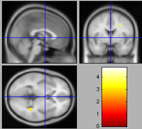

```{r, include=FALSE}
knitr::opts_chunk$set(echo = TRUE)

library(coefplot2)
library(pander)

```


```{asis eval=params$summary}

## Hypothesis

```


| `r ifelse(params$summary,'Hypothesis','') ` |  `r ifelse(params$summary,'Result','') ` |
| --------------------------------------------------- | --- |
| `r ifelse(params$summary,'**H1.1**','[**H1.1**](hypotheses/H1.1.md)')`: Those with higher ego betweenness centrality will show higher activity in the mentalizing system than those with lower ego betweenness centrality when learning about group ratings and when making final ratings in Phase 2 of the Application Recommendation Task (Contrasts: group feedback vs. no group feedback conditions; group feedback different vs. group feedback similar conditions). | Null - no significant clusters on whole brain analysis  |


```{r, results='asis', eval=params$summary, echo=FALSE}

pandoc.header("Results", level=2)
pandoc.header(paste('Model','-',params$htitle), level=3)

```

```{asis, eval=params$summary}
* Whole brain model showing the FEEDBACK > NOFEEDBACK contrast with HIGH > LOW ego betweenness



```
