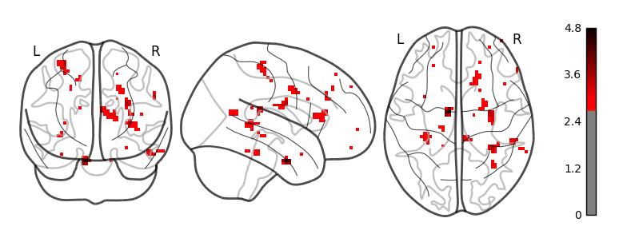
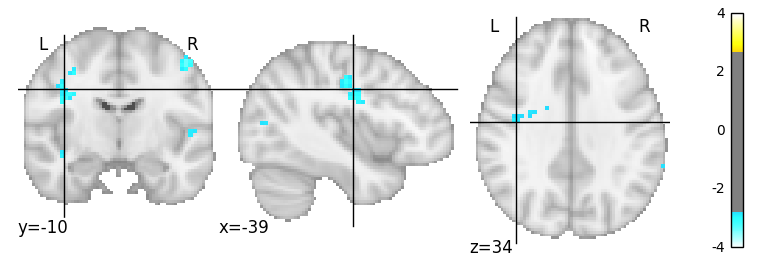

H1.1 - Ego betweenness Centrality and Mentalizing Activity
================
@StudyTeam
10/12/2017

-   [Hypothesis](#hypothesis)
-   [Results](#results)
    -   [ROI Results](#roi-results)
    -   [Whole Brain Results](#whole-brain-results)

Hypothesis
----------

<table style="width:78%;">
<colgroup>
<col width="72%" />
<col width="5%" />
</colgroup>
<thead>
<tr class="header">
<th>Hypothesis</th>
<th>Result</th>
</tr>
</thead>
<tbody>
<tr class="odd">
<td><strong>H1.1</strong>: Those with higher ego betweenness centrality will show higher activity in the mentalizing system than those with lower ego betweenness centrality when learning about group ratings and when making final ratings in Phase 2 of the Application Recommendation Task (Contrasts: group feedback vs. no group feedback conditions; group feedback different vs. group feedback similar conditions).</td>
<td>Not Significant</td>
</tr>
</tbody>
</table>

Results
-------

### ROI Results

-   We extracted activity in the mentalizing ROI, which was defined by searching the Neurosynth (Yarkoni, Poldrack, Nichols, Van Essen, & Wager, 2011) database using the term ‘mentalizing', identifying regions to be associated with mentalizing activity in 124 published neuroscience studies. 

-   Activity in this ROI was extracted for the main contrasts of interest: 1) group feedback &gt; no group feedback and 2) group feedback different &gt; group feedback similar.
-   Then, we conducted linear regressions to determine if activity in the mentalizing ROI was associated with individuals' ego-betweenness.

<strong>1) Group Feedback &gt; No Group Feedback Contrast:</strong>

    ## lm(formula = gFEEDBACK_vs_NR ~ ego, data = df_combined_ment)

    ##             Estimate   2.5% 97.5%
    ## (Intercept)    0.024 -0.005 0.053
    ## egolow        -0.005 -0.047 0.036

    ## 
    ## Call:
    ## lm(formula = gFEEDBACK_vs_NR ~ ego, data = df_combined_ment)
    ## 
    ## Residuals:
    ##       Min        1Q    Median        3Q       Max 
    ## -0.105858 -0.057692  0.009904  0.028549  0.191124 
    ## 
    ## Coefficients:
    ##              Estimate Std. Error t value Pr(>|t|)
    ## (Intercept)  0.024146   0.014669   1.646    0.108
    ## egolow      -0.005198   0.021258  -0.245    0.808
    ## 
    ## Residual standard error: 0.06881 on 40 degrees of freedom
    ## Multiple R-squared:  0.001493,   Adjusted R-squared:  -0.02347 
    ## F-statistic: 0.05979 on 1 and 40 DF,  p-value: 0.8081

<strong>2) Group Feedback Different &gt; Group Feedback Similar Contrast:</strong>

    ## lm(formula = gDIFF_vs_gSAME ~ ego, data = df_combined_ment)

    ##             Estimate   2.5% 97.5%
    ## (Intercept)    0.023  0.000 0.045
    ## egolow         0.011 -0.021 0.044

    ## 
    ## Call:
    ## lm(formula = gDIFF_vs_gSAME ~ ego, data = df_combined_ment)
    ## 
    ## Residuals:
    ##       Min        1Q    Median        3Q       Max 
    ## -0.171444 -0.029257  0.003556  0.025811  0.116136 
    ## 
    ## Coefficients:
    ##             Estimate Std. Error t value Pr(>|t|)  
    ## (Intercept)  0.02259    0.01144   1.976   0.0551 .
    ## egolow       0.01120    0.01657   0.676   0.5032  
    ## ---
    ## Signif. codes:  0 '***' 0.001 '**' 0.01 '*' 0.05 '.' 0.1 ' ' 1
    ## 
    ## Residual standard error: 0.05364 on 40 degrees of freedom
    ## Multiple R-squared:  0.01128,    Adjusted R-squared:  -0.01344 
    ## F-statistic: 0.4564 on 1 and 40 DF,  p-value: 0.5032

### Whole Brain Results

-   Here are the whole brain results of the contrast: <strong>group feedback &gt; no group feedback</strong> with a two-sample t-test at the group level of high ego betweenness vs. low ego betweenness. No significant clusters survived FDR correction at p=.05.
-   Here are exploratory results at p&lt;.001; k=5 that do not seem to show meaningful clusters in our hypothesized regions.  

-   Here are the whole brain results of the contrast: <strong>group feedback different &gt; group feedback similar</strong> with a two-sample t-test at the group level of high ego betweenness vs. low ego betweenness. No significant clusters survived FDR correction at p=.05.
-   Here are exploratory results at p&lt;.001; k=5 that do not seem to show meaningful clusters in our hypothesized regions. Please note that the results indicate negative activations.  
