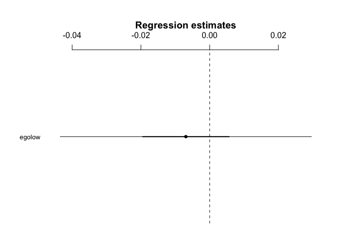

H1.2 - Ego betweenness and mentalizing
================
@darpa\_study\_team
10/12/2017

-   [Hypothesis](#hypothesis)
-   [Results](#results)
    -   [Model - Ego betweenness and mentalizing](#model---ego-betweenness-and-mentalizing)

Hypothesis
----------

<table style="width:78%;">
<colgroup>
<col width="72%" />
<col width="5%" />
</colgroup>
<thead>
<tr class="header">
<th>Hypothesis</th>
<th>Result</th>
</tr>
</thead>
<tbody>
<tr class="odd">
<td><strong>H1.2</strong>: Those with higher ego betweenness centrality will show higher activity in the mentalizing system when reading article abstracts and while making sharing decisions in the Sharing Task than those with lower ego betweenness centrality (Contrasts: Sharing conditions [broad- &amp; narrowcasting] vs. no sharing conditions [self and topic conditions]).</td>
<td>Not Significant t(39)=-0.371</td>
</tr>
</tbody>
</table>

Results
-------

### Model - Ego betweenness and mentalizing

    ## lm(formula = SHAREvsNONSHARE_reading ~ ego, data = df_combined_ment)

    ##             Estimate 2.5% 97.5%
    ## (Intercept)      0.1  0.0   0.1
    ## egolow           0.0  0.0   0.0

    ## 
    ## Call:
    ## lm(formula = SHAREvsNONSHARE_reading ~ ego, data = df_combined_ment)
    ## 
    ## Residuals:
    ##       Min        1Q    Median        3Q       Max 
    ## -0.129947 -0.031126 -0.004449  0.038869  0.141439 
    ## 
    ## Coefficients:
    ##              Estimate Std. Error t value Pr(>|t|)    
    ## (Intercept)  0.073821   0.013020   5.670 1.49e-06 ***
    ## egolow      -0.006924   0.018642  -0.371    0.712    
    ## ---
    ## Signif. codes:  0 '***' 0.001 '**' 0.01 '*' 0.05 '.' 0.1 ' ' 1
    ## 
    ## Residual standard error: 0.05967 on 39 degrees of freedom
    ## Multiple R-squared:  0.003525,   Adjusted R-squared:  -0.02203 
    ## F-statistic: 0.1379 on 1 and 39 DF,  p-value: 0.7123
