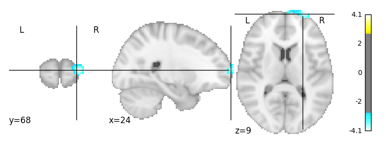

H1.2 - Ego betweenness Centrality and Mentalizing Activity
================
@StudyTeam
10/12/2017

-   [Hypothesis](#hypothesis)
-   [Results](#results)
    -   [ROI Results](#roi-results)
    -   [Whole Brain Results](#whole-brain-results)

Hypothesis
----------

<table style="width:78%;">
<colgroup>
<col width="72%" />
<col width="5%" />
</colgroup>
<thead>
<tr class="header">
<th>Hypothesis</th>
<th>Result</th>
</tr>
</thead>
<tbody>
<tr class="odd">
<td><strong>H1.2</strong>: Those with higher ego betweenness centrality will show higher activity in the mentalizing system when reading article abstracts and while making sharing decisions in the Sharing Task than those with lower ego betweenness centrality (Contrasts: Sharing conditions [broad- &amp; narrowcasting] vs. no sharing conditions [self and topic conditions]).</td>
<td>Not Significant</td>
</tr>
</tbody>
</table>

Results
-------

### ROI Results

-   We extracted activity in the mentalizing ROI, which was defined by searching the reverse-inference map on Neurosynth (Yarkoni, Poldrack, Nichols, Van Essen, & Wager, 2011) database using the term ‘mentalizing', identifying regions to be associated with mentalizing activity in 124 published neuroscience studies. 

-   Activity in this ROI was extracted for the main contrast of interest: sharing (broad- and narrowcasting) &gt; non-sharing (self and topic)
-   Then, we conducted linear regressions to determine if activity in the mentalizing ROI was associated with individuals' ego-betweenness.

<strong>Sharing vs. Non-Sharing Contrast:</strong>  Note: egolow refers to the comparison of low ego-betweenness compared to high ego-betweenness group, which serves as the reference level in the analysis.

    ## lm(formula = SHAREvsNONSHARE_both ~ ego, data = df_combined_ment)

    ##             Estimate   2.5% 97.5%
    ## (Intercept)    0.226  0.097 0.354
    ## egolow         0.056 -0.128 0.240

    ## 
    ## Call:
    ## lm(formula = SHAREvsNONSHARE_both ~ ego, data = df_combined_ment)
    ## 
    ## Residuals:
    ##      Min       1Q   Median       3Q      Max 
    ## -0.48185 -0.16939 -0.06949  0.16900  1.18738 
    ## 
    ## Coefficients:
    ##             Estimate Std. Error t value Pr(>|t|)   
    ## (Intercept)  0.22593    0.06558   3.445  0.00138 **
    ## egolow       0.05560    0.09390   0.592  0.55720   
    ## ---
    ## Signif. codes:  0 '***' 0.001 '**' 0.01 '*' 0.05 '.' 0.1 ' ' 1
    ## 
    ## Residual standard error: 0.3005 on 39 degrees of freedom
    ## Multiple R-squared:  0.008909,   Adjusted R-squared:  -0.0165 
    ## F-statistic: 0.3506 on 1 and 39 DF,  p-value: 0.5572

### Whole Brain Results

-   Here are the whole brain results of the contrast: <strong>sharing (broad- and narrowcasting) &gt; non-sharing (self and topic)</strong> with a two-sample t-test at the group level of high ego betweenness vs. low ego betweenness. No significant clusters survived FDR correction at p=.05.
-   Here are exploratory results at p&lt;.005; k=5 that include clusters in the ventral prefrontal cortex and precuneus.  
