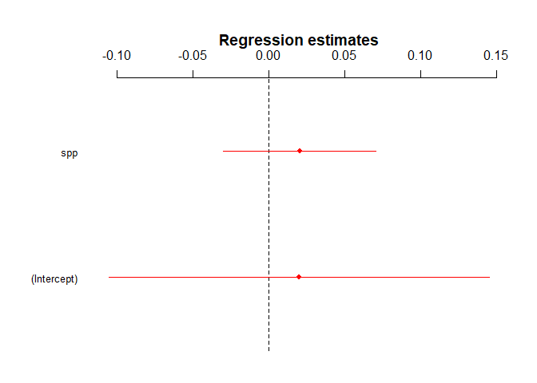
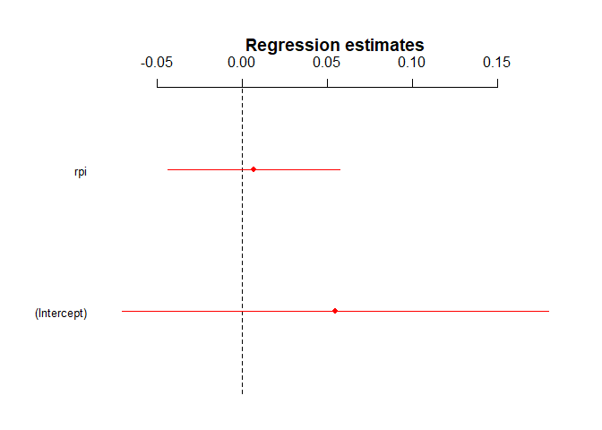

H2.3
================
@darpa\_study\_team
10/12/2017

-   [Hypothesis](#hypothesis)
-   [Results](#results)
    -   [Model 1 - Resistance to peer influence](#model-1---resistance-to-peer-influence)
    -   [Model 2 - Susceptibility to peer pressure](#model-2---susceptibility-to-peer-pressure)

Hypothesis
----------

<table style="width:78%;">
<colgroup>
<col width="72%" />
<col width="5%" />
</colgroup>
<thead>
<tr class="header">
<th>Hypothesis</th>
<th>Result</th>
</tr>
</thead>
<tbody>
<tr class="odd">
<td><strong>H2.3</strong>: The higher a participant's score on the resistance to peer influence and/or the lower their score on the susceptibility to peer pressure scale, the lower the activation in the mentalizing system while reading article abstracts and while making sharing decisions in Phase 2 of the Sharing Task (Contrasts: sharing vs. no sharing conditions).</td>
<td>Not Significant t(39)=0.796 t(39)=0.252</td>
</tr>
</tbody>
</table>

Results
-------

### Model 1 - Resistance to peer influence

    ## lm(formula = SHAREvsNONSHARE_reading ~ spp, data = df_combined_ment)

    ##              Estimate      2.5%  97.5%
    ## (Intercept)  0.020010 -0.105530 0.1456
    ## spp          0.020363 -0.029793 0.0705

    ## 
    ## Call:
    ## lm(formula = SHAREvsNONSHARE_reading ~ spp, data = df_combined_ment)
    ## 
    ## Residuals:
    ##       Min        1Q    Median        3Q       Max 
    ## -0.122415 -0.030518 -0.001458  0.040096  0.141566 
    ## 
    ## Coefficients:
    ##             Estimate Std. Error t value Pr(>|t|)
    ## (Intercept)  0.02001    0.06405   0.312    0.756
    ## spp          0.02036    0.02559   0.796    0.431
    ## 
    ## Residual standard error: 0.05929 on 39 degrees of freedom
    ## Multiple R-squared:  0.01598,    Adjusted R-squared:  -0.009255 
    ## F-statistic: 0.6332 on 1 and 39 DF,  p-value: 0.431

### Model 2 - Susceptibility to peer pressure

    ## lm(formula = SHAREvsNONSHARE_reading ~ rpi, data = df_combined_ment)

    ##             Estimate 2.5% 97.5%
    ## (Intercept)      0.1 -0.1   0.2
    ## rpi              0.0  0.0   0.1

    ## 
    ## Call:
    ## lm(formula = SHAREvsNONSHARE_reading ~ rpi, data = df_combined_ment)
    ## 
    ## Residuals:
    ##       Min        1Q    Median        3Q       Max 
    ## -0.124773 -0.036922 -0.004026  0.040041  0.142607 
    ## 
    ## Coefficients:
    ##             Estimate Std. Error t value Pr(>|t|)
    ## (Intercept) 0.054507   0.064036   0.851    0.400
    ## rpi         0.006481   0.025763   0.252    0.803
    ## 
    ## Residual standard error: 0.05972 on 39 degrees of freedom
    ## Multiple R-squared:  0.00162,    Adjusted R-squared:  -0.02398 
    ## F-statistic: 0.06328 on 1 and 39 DF,  p-value: 0.8027
