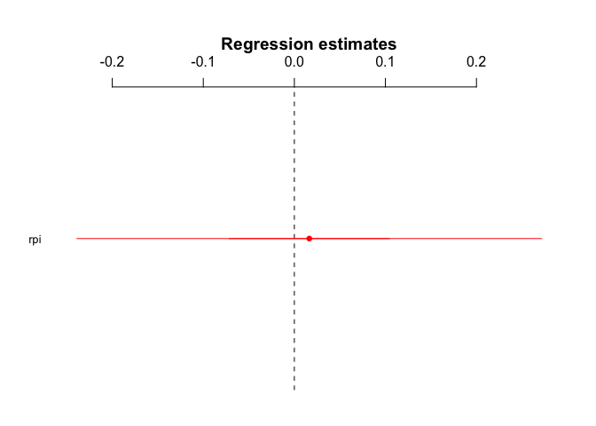

H2.3 - Resistance to Peer Influence, Susceptibility to Peer Pressure and Mentalizing Activity
================
@StudyTeam
10/12/2017

-   [Hypothesis](#hypothesis)
-   [Results](#results)
    -   [ROI Results](#roi-results)
    -   [Whole Brain Results](#whole-brain-results)

Hypothesis
----------

<table style="width:78%;">
<colgroup>
<col width="72%" />
<col width="5%" />
</colgroup>
<thead>
<tr class="header">
<th>Hypothesis</th>
<th>Result</th>
</tr>
</thead>
<tbody>
<tr class="odd">
<td><strong>H2.3</strong>: The higher a participant's score on the resistance to peer influence and/or the lower their score on the susceptibility to peer pressure scale, the lower the activation in the mentalizing system while reading article abstracts and while making sharing decisions in Phase 2 of the Sharing Task (Contrasts: sharing vs. no sharing conditions).</td>
<td>Not Significant</td>
</tr>
</tbody>
</table>

Results
-------

### ROI Results

-   We extracted activity in the mentalizing ROI, which was defined by searching the reverse-inference map on Neurosynth (Yarkoni, Poldrack, Nichols, Van Essen, & Wager, 2011) database using the term ‘mentalizing', identifying regions to be associated with mentalizing activity in 124 published neuroscience studies. 

-   Activity in this ROI was extracted for the main contrast of interest: sharing (broad- and narrowcasting) &gt; non-sharing (self and topic).
-   Then, we conducted linear regressions to determine if activity in the mentalizing ROI was associated with individuals' 1) resistance to peer influence (RPI) and 2) susceptibility to peer pressure (SPP).

<strong>1) Resistance to Peer Influence (RPI):</strong> 

    ## lm(formula = SHAREvsNONSHARE_both ~ rpi, data = df_combined_ment)

    ##             Estimate   2.5% 97.5%
    ## (Intercept)    0.213 -0.422 0.847
    ## rpi            0.016 -0.239 0.272

    ## 
    ## Call:
    ## lm(formula = SHAREvsNONSHARE_both ~ rpi, data = df_combined_ment)
    ## 
    ## Residuals:
    ##      Min       1Q   Median       3Q      Max 
    ## -0.51128 -0.19196 -0.04708  0.20172  1.21518 
    ## 
    ## Coefficients:
    ##             Estimate Std. Error t value Pr(>|t|)
    ## (Intercept)  0.21270    0.32362   0.657    0.515
    ## rpi          0.01641    0.13020   0.126    0.900
    ## 
    ## Residual standard error: 0.3018 on 39 degrees of freedom
    ## Multiple R-squared:  0.000407,   Adjusted R-squared:  -0.02522 
    ## F-statistic: 0.01588 on 1 and 39 DF,  p-value: 0.9004

<strong>2) Susceptibility to Peer Pressure:</strong> 

    ## lm(formula = SHAREvsNONSHARE_both ~ spp, data = df_combined_ment)

    ##             Estimate   2.5% 97.5%
    ## (Intercept)   -0.202 -0.825 0.421
    ## spp            0.184 -0.065 0.433

    ## 
    ## Call:
    ## lm(formula = SHAREvsNONSHARE_both ~ spp, data = df_combined_ment)
    ## 
    ## Residuals:
    ##     Min      1Q  Median      3Q     Max 
    ## -0.4882 -0.1893 -0.0450  0.1726  1.1865 
    ## 
    ## Coefficients:
    ##             Estimate Std. Error t value Pr(>|t|)
    ## (Intercept)  -0.2021     0.3177  -0.636    0.528
    ## spp           0.1838     0.1269   1.448    0.156
    ## 
    ## Residual standard error: 0.2941 on 39 degrees of freedom
    ## Multiple R-squared:  0.05102,    Adjusted R-squared:  0.02669 
    ## F-statistic: 2.097 on 1 and 39 DF,  p-value: 0.1556

### Whole Brain Results

<strong>1) Resistance to Peer Influence (RPI):</strong> 

-   Here are the whole brain results of the contrast: <strong>sharing (broad- and narrowcasting) &gt; non-sharing (self and topic)</strong> with a multi-level regression of resistance to peer influence scores. No significant clusters survived FDR correction at p=.05.
-   Here are exploratory results at p&lt;.005; k=5 that include clusters in the striatum.  

<strong>2) Susceptibility to Peer Pressure:</strong> 

-   Here are the whole brain results of the contrast: <strong>sharing (broad- and narrowcasting) &gt; non-sharing (self and topic)</strong> with a multi-level regression of susceptibility to peer pressure scores. No significant clusters survived FDR correction at p=.05.
-   Here are exploratory results at p&lt;.005; k=5 that include clusters in the dorsolateral prefrontal cortex, ventromedial prefrontal cortex, striatum, and cerebellum.  
