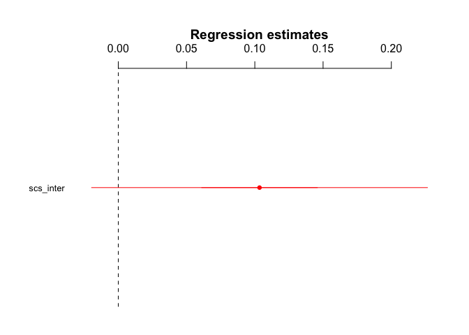
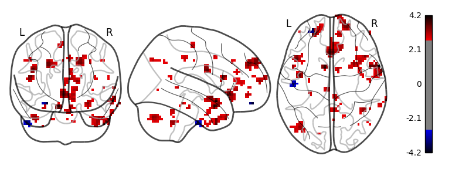
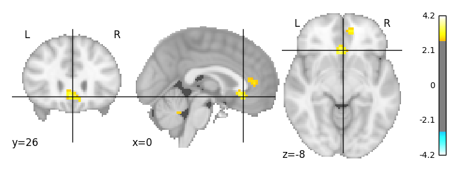

H3.3 - Interdependence and Mentalizing Activity
================
@StudyTeam
10/12/2017

-   [Hypothesis](#hypothesis)
-   [Results](#results)
    -   [ROI Results](#roi-results)
    -   [Whole Brain Results](#whole-brain-results)

Hypothesis
----------

<table style="width:78%;">
<colgroup>
<col width="72%" />
<col width="5%" />
</colgroup>
<thead>
<tr class="header">
<th>Hypothesis</th>
<th>Result</th>
</tr>
</thead>
<tbody>
<tr class="odd">
<td><strong>H3.3</strong>: The higher a participant’s score on the interdependence subscale of the self-construal scale, the stronger the activation in the mentalizing system and the more self-other overlap in the ventral-dorsal gradient of self/other-related MPFC activation when making sharing decisions in the Sharing Task (Contrast: Sharing vs. no sharing conditions).</td>
<td>Not Significant (self/other gradient not tested) t(39)=1.649</td>
</tr>
</tbody>
</table>

Results
-------

### ROI Results

-   We extracted activity in the mentalizing ROI, which was defined by searching the reverse-inference map on Neurosynth (Yarkoni, Poldrack, Nichols, Van Essen, & Wager, 2011) database using the term ‘mentalizing', identifying regions to be associated with mentalizing activity in 124 published neuroscience studies. 

-   Activity in this ROI was extracted for the main contrast of interest: sharing (broad- and narrowcasting) &gt; non-sharing (self and topic).
-   Then, we conducted linear regressions to determine if activity in the mentalizing ROI was associated with individuals' interdepdence subscale score from the self-construal scale.

<!-- -->

    ##             Estimate   2.5% 97.5%
    ## (Intercept)   -0.235 -0.823 0.352
    ## scs_inter      0.103 -0.020 0.226

    ## 
    ## Call:
    ## lm(formula = SHAREvsNONSHARE_both ~ scs_inter, data = df_combined_ment)
    ## 
    ## Residuals:
    ##      Min       1Q   Median       3Q      Max 
    ## -0.44135 -0.16002 -0.02778  0.13445  1.17313 
    ## 
    ## Coefficients:
    ##             Estimate Std. Error t value Pr(>|t|)
    ## (Intercept) -0.23527    0.29967  -0.785    0.437
    ## scs_inter    0.10345    0.06275   1.649    0.107
    ## 
    ## Residual standard error: 0.2919 on 39 degrees of freedom
    ## Multiple R-squared:  0.06515,    Adjusted R-squared:  0.04118 
    ## F-statistic: 2.718 on 1 and 39 DF,  p-value: 0.1073

### Whole Brain Results

-   Here are the whole brain results of the contrast: <strong>sharing (broad- and narrowcasting) &gt; non-sharing (self and topic)</strong> with a multi-level regression of interdependence scores. No significant clusters survived FDR correction at p=.05.
-   Here are exploratory results at p&lt;.005; k=5 that include clusters in the dorsolateral prefrontal cortex, striatum, and cerebellum.  
