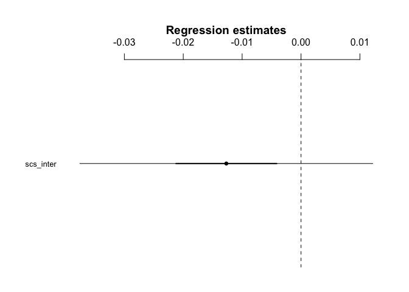

H3.3
================
@darpa\_study\_team
10/12/2017

-   [Hypothesis](#hypothesis)
-   [Results](#results)
    -   [Model - Interdependence and mentalizing](#model---interdependence-and-mentalizing)

Hypothesis
----------

<table style="width:78%;">
<colgroup>
<col width="72%" />
<col width="5%" />
</colgroup>
<thead>
<tr class="header">
<th>Hypothesis</th>
<th>Result</th>
</tr>
</thead>
<tbody>
<tr class="odd">
<td><strong>H3.3</strong>: The higher a participant’s score on the interdependence subscale of the self-construal scale, the stronger the activation in the mentalizing system and the more self-other overlap in the ventral-dorsal gradient of self/other-related MPFC activation when making sharing decisions in the Sharing Task (Contrast: Sharing vs. no sharing conditions).</td>
<td>Not Significant (self/other gradient not tested) t(39)=-1</td>
</tr>
</tbody>
</table>

Results
-------

### Model - Interdependence and mentalizing

    ## lm(formula = SHAREvsNONSHARE_reading ~ scs_inter, data = df_combined_ment)

    ##             Estimate 2.5% 97.5%
    ## (Intercept)      0.1  0.0   0.2
    ## scs_inter        0.0  0.0   0.0

    ## 
    ## Call:
    ## lm(formula = SHAREvsNONSHARE_reading ~ scs_inter, data = df_combined_ment)
    ## 
    ## Residuals:
    ##       Min        1Q    Median        3Q       Max 
    ## -0.124713 -0.029955 -0.007744  0.039707  0.141598 
    ## 
    ## Coefficients:
    ##             Estimate Std. Error t value Pr(>|t|)  
    ## (Intercept)  0.13033    0.06060   2.151   0.0377 *
    ## scs_inter   -0.01269    0.01269  -1.000   0.3235  
    ## ---
    ## Signif. codes:  0 '***' 0.001 '**' 0.01 '*' 0.05 '.' 0.1 ' ' 1
    ## 
    ## Residual standard error: 0.05902 on 39 degrees of freedom
    ## Multiple R-squared:  0.025,  Adjusted R-squared:  -3.053e-06 
    ## F-statistic: 0.9999 on 1 and 39 DF,  p-value: 0.3235
