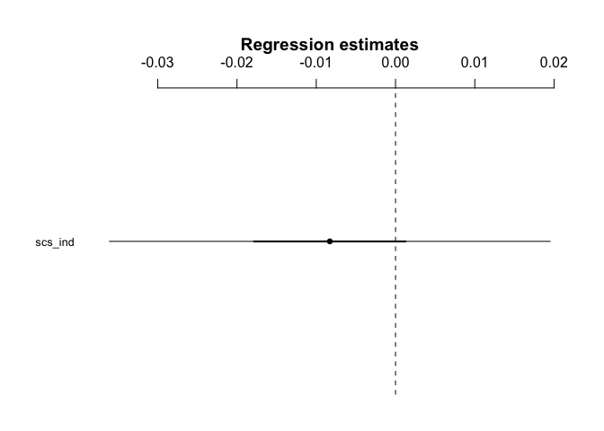

H3.4
================
@darpa\_study\_team
10/12/2017

-   [Hypothesis](#hypothesis)
-   [Results](#results)
    -   [Model - Independence and mentalizing](#model---independence-and-mentalizing)

Hypothesis
----------

<table style="width:78%;">
<colgroup>
<col width="72%" />
<col width="5%" />
</colgroup>
<thead>
<tr class="header">
<th>Hypothesis</th>
<th>Result</th>
</tr>
</thead>
<tbody>
<tr class="odd">
<td><strong>H3.4</strong>: The higher a participant’s score on the independence subscale of the self-construal scale, the stronger the activation in the mentalizing system and the more self-other overlap in the ventral-dorsal gradient of self/other-related MPFC activation when making sharing decisions in the Sharing Task (Contrast: Sharing vs. no sharing conditions).</td>
<td>Not Significant (self/other gradient not tested) t(39)=-0.584</td>
</tr>
</tbody>
</table>

Results
-------

### Model - Independence and mentalizing

    ## lm(formula = SHAREvsNONSHARE_reading ~ scs_ind, data = df_combined_ment)

    ##             Estimate 2.5% 97.5%
    ## (Intercept)      0.1  0.0   0.3
    ## scs_ind          0.0  0.0   0.0

    ## 
    ## Call:
    ## lm(formula = SHAREvsNONSHARE_reading ~ scs_ind, data = df_combined_ment)
    ## 
    ## Residuals:
    ##       Min        1Q    Median        3Q       Max 
    ## -0.128173 -0.031807 -0.006469  0.040578  0.136031 
    ## 
    ## Coefficients:
    ##              Estimate Std. Error t value Pr(>|t|)
    ## (Intercept)  0.112931   0.073284   1.541    0.131
    ## scs_ind     -0.008287   0.014179  -0.584    0.562
    ## 
    ## Residual standard error: 0.05951 on 39 degrees of freedom
    ## Multiple R-squared:  0.008683,   Adjusted R-squared:  -0.01673 
    ## F-statistic: 0.3416 on 1 and 39 DF,  p-value: 0.5623
