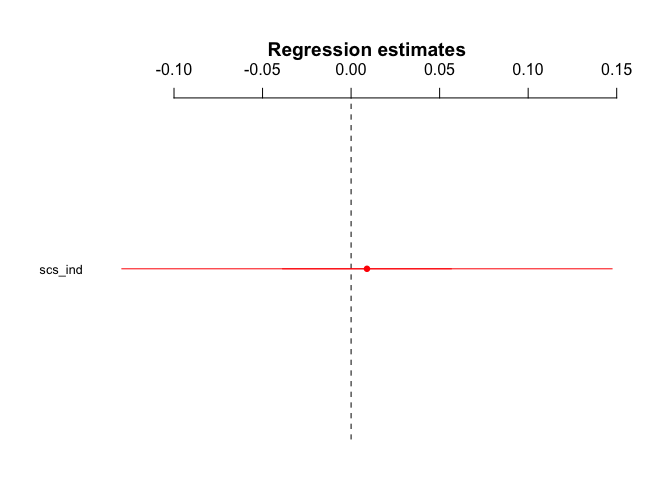

H3.4 - Independence and Mentalizing Activity
================
@StudyTeam
10/12/2017

-   [Hypothesis](#hypothesis)
-   [Results](#results)
    -   [ROI Results](#roi-results)
    -   [Whole Brain Results](#whole-brain-results)

Hypothesis
----------

<table style="width:78%;">
<colgroup>
<col width="72%" />
<col width="5%" />
</colgroup>
<thead>
<tr class="header">
<th>Hypothesis</th>
<th>Result</th>
</tr>
</thead>
<tbody>
<tr class="odd">
<td><strong>H3.4</strong>: The higher a participant’s score on the independence subscale of the self-construal scale, the stronger the activation in the mentalizing system and the more self-other overlap in the ventral-dorsal gradient of self/other-related MPFC activation when making sharing decisions in the Sharing Task (Contrast: Sharing vs. no sharing conditions).</td>
<td>Not Significant (self/other gradient not tested)</td>
</tr>
</tbody>
</table>

Results
-------

### ROI Results

-   We extracted activity in the mentalizing ROI, which was defined by searching the reverse-inference map on Neurosynth (Yarkoni, Poldrack, Nichols, Van Essen, & Wager, 2011) database using the term ‘mentalizing', identifying regions to be associated with mentalizing activity in 124 published neuroscience studies. 

-   Activity in this ROI was extracted for the main contrast of interest: sharing (broad- and narrowcasting) &gt; non-sharing (self and topic).
-   Then, we conducted linear regressions to determine if activity in the mentalizing ROI was associated with individuals' independence subscale score from the self-construal scale.

<!-- -->

    ## lm(formula = SHAREvsNONSHARE_both ~ scs_ind, data = df_combined_ment)

    ##             Estimate   2.5% 97.5%
    ## (Intercept)    0.189 -0.527 0.904
    ## scs_ind        0.009 -0.129 0.147

    ## 
    ## Call:
    ## lm(formula = SHAREvsNONSHARE_both ~ scs_ind, data = df_combined_ment)
    ## 
    ## Residuals:
    ##      Min       1Q   Median       3Q      Max 
    ## -0.43856 -0.14850 -0.08463  0.19058  1.24857 
    ## 
    ## Coefficients:
    ##             Estimate Std. Error t value Pr(>|t|)
    ## (Intercept) 0.188908   0.365021   0.518    0.608
    ## scs_ind     0.008968   0.070623   0.127    0.900
    ## 
    ## Residual standard error: 0.2964 on 39 degrees of freedom
    ## Multiple R-squared:  0.0004132,  Adjusted R-squared:  -0.02522 
    ## F-statistic: 0.01612 on 1 and 39 DF,  p-value: 0.8996

### Whole Brain Results

-   Here are the whole brain results of the contrast: <strong>sharing (broad- and narrowcasting) &gt; non-sharing (self and topic)</strong> with a multi-level regression of independence scores. No significant clusters survived FDR correction at p=.05.
-   Here are exploratory results at p&lt;.005; k=5 that include a cluster in the left ventrolateral prefrontal cortex.  
