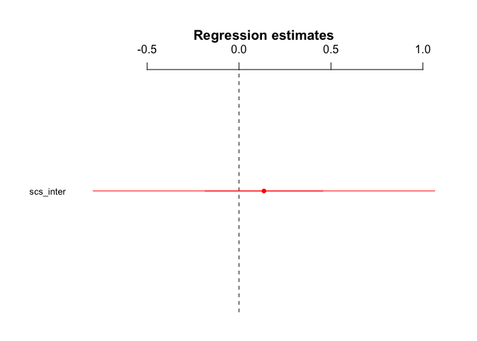

H3.7 - Interdependence and Use of Social Language
================
@StudyTeam
10/12/2017

-   [Hypothesis](#hypothesis)
-   [Results](#results)

Hypothesis
----------

<table style="width:78%;">
<colgroup>
<col width="72%" />
<col width="5%" />
</colgroup>
<thead>
<tr class="header">
<th>Hypothesis</th>
<th>Result</th>
</tr>
</thead>
<tbody>
<tr class="odd">
<td><strong>H3.7</strong>: The higher a participant’s score on the interdependence subscale of the self-construal scale, the more social words (as defined by the LIWC dictionary) the participant will use in their posts/messages for the Sharing Task (Phase 2).</td>
<td>Not Significant</td>
</tr>
</tbody>
</table>

Results
-------

-   First, the number of social words that participants used in their sharing messages about the articles was quantified by using LIWC (Linguistic Inquiry and Word Count) dictionary (Pennebaker, et al., 2001).
-   Then, we ran a multi-level regression to determine whether there was a relationship between participants' usage of social words and their interdepedence scores.

<!-- -->

    ## lme4::lmer(formula = r_social ~ scs_inter + (1 | pID), data = language_id)

    ##             Estimate   2.5%  97.5%
    ## (Intercept)    8.196  3.788 12.604
    ## scs_inter      0.135 -0.793  1.064

    ## Linear mixed model fit by REML t-tests use Satterthwaite approximations
    ##   to degrees of freedom [lmerMod]
    ## Formula: r_social ~ scs_inter + (1 | pID)
    ##    Data: language_id
    ## 
    ## REML criterion at convergence: 10118.7
    ## 
    ## Scaled residuals: 
    ##     Min      1Q  Median      3Q     Max 
    ## -2.1810 -0.7530 -0.0575  0.6806  3.8816 
    ## 
    ## Random effects:
    ##  Groups   Name        Variance Std.Dev.
    ##  pID      (Intercept)  3.967   1.992   
    ##  Residual             36.897   6.074   
    ## Number of obs: 1560, groups:  pID, 39
    ## 
    ## Fixed effects:
    ##             Estimate Std. Error      df t value Pr(>|t|)    
    ## (Intercept)   8.1961     2.2492 37.0000   3.644 0.000819 ***
    ## scs_inter     0.1355     0.4739 37.0000   0.286 0.776547    
    ## ---
    ## Signif. codes:  0 '***' 0.001 '**' 0.01 '*' 0.05 '.' 0.1 ' ' 1
    ## 
    ## Correlation of Fixed Effects:
    ##           (Intr)
    ## scs_inter -0.988
