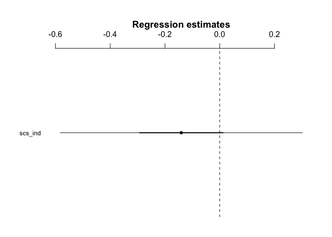

H3.8
================
@darpa\_study\_team
10/12/2017

-   [Hypothesis](#hypothesis)
-   [Results](#results)
    -   [Model - Independence and use of social language](#model---independence-and-use-of-social-language)

Hypothesis
----------

<table style="width:78%;">
<colgroup>
<col width="72%" />
<col width="5%" />
</colgroup>
<thead>
<tr class="header">
<th>Hypothesis</th>
<th>Result</th>
</tr>
</thead>
<tbody>
<tr class="odd">
<td><strong>H3.8</strong>: The lower a participant’s score on the independence subscale of the self-construal scale, the more social words (as defined by the LIWC dictionary) the participant will use in their posts/messages for the Sharing Task (Phase 2).</td>
<td>Not Significant t(1558)=-0.622</td>
</tr>
</tbody>
</table>

Results
-------

### Model - Independence and use of social language

    ## lm(formula = r_social ~ scs_ind, data = language_id)

    ##             Estimate 2.5% 97.5%
    ## (Intercept)      9.5  7.3  11.8
    ## scs_ind         -0.1 -0.6   0.3

    ## 
    ## Call:
    ## lm(formula = r_social ~ scs_ind, data = language_id)
    ## 
    ## Residuals:
    ##     Min      1Q  Median      3Q     Max 
    ## -9.0967 -4.5689 -0.0318  4.5524 24.4579 
    ## 
    ## Coefficients:
    ##             Estimate Std. Error t value Pr(>|t|)    
    ## (Intercept)   9.5458     1.1605   8.226 4.05e-16 ***
    ## scs_ind      -0.1404     0.2257  -0.622    0.534    
    ## ---
    ## Signif. codes:  0 '***' 0.001 '**' 0.01 '*' 0.05 '.' 0.1 ' ' 1
    ## 
    ## Residual standard error: 6.377 on 1558 degrees of freedom
    ## Multiple R-squared:  0.0002482,  Adjusted R-squared:  -0.0003935 
    ## F-statistic: 0.3868 on 1 and 1558 DF,  p-value: 0.5341
