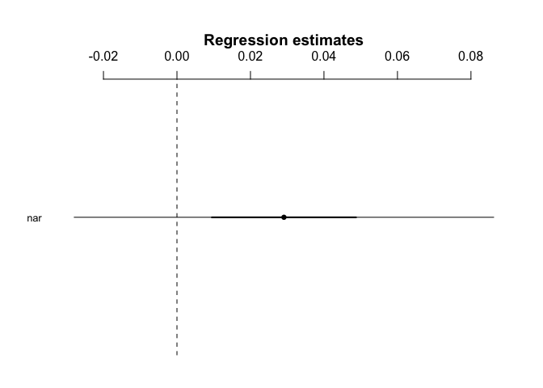

H7.2 - Narcissism and use of self-related language
================
@darpa\_study\_team
10/12/2017

-   [Hypothesis](#hypothesis)
-   [Results](#results)
    -   [Model - Narcissism and use of self-related language](#model---narcissism-and-use-of-self-related-language)

Hypothesis
----------

<table style="width:78%;">
<colgroup>
<col width="72%" />
<col width="5%" />
</colgroup>
<thead>
<tr class="header">
<th>Hypothesis</th>
<th>Result</th>
</tr>
</thead>
<tbody>
<tr class="odd">
<td><strong>7.2</strong>: Those who score higher on narcissism will use more self-related language (first person singular) when writing Application reviews and Facebook messages in the Application Recommendation (Phase 3) and Sharing Tasks (Phase 2).</td>
<td>Not Significant t(1558)=1</td>
</tr>
</tbody>
</table>

Results
-------

### Model - Narcissism and use of self-related language

    ## lm(formula = r_i ~ nar, data = language_id)

    ##             Estimate 2.5% 97.5%
    ## (Intercept)      3.8  3.0   4.5
    ## nar              0.0  0.0   0.1

    ## 
    ## Call:
    ## lm(formula = r_i ~ nar, data = language_id)
    ## 
    ## Residuals:
    ##     Min      1Q  Median      3Q     Max 
    ## -4.3675 -4.1346 -0.5064  2.5354 29.0499 
    ## 
    ## Coefficients:
    ##             Estimate Std. Error t value Pr(>|t|)    
    ## (Intercept)  3.75613    0.40044    9.38   <2e-16 ***
    ## nar          0.02911    0.02911    1.00    0.317    
    ## ---
    ## Signif. codes:  0 '***' 0.001 '**' 0.01 '*' 0.05 '.' 0.1 ' ' 1
    ## 
    ## Residual standard error: 4.717 on 1558 degrees of freedom
    ## Multiple R-squared:  0.0006414,  Adjusted R-squared:  -8.667e-08 
    ## F-statistic: 0.9999 on 1 and 1558 DF,  p-value: 0.3175
